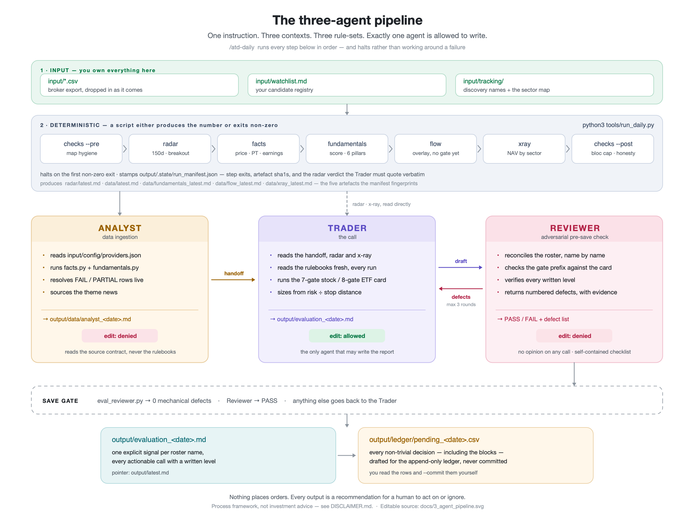
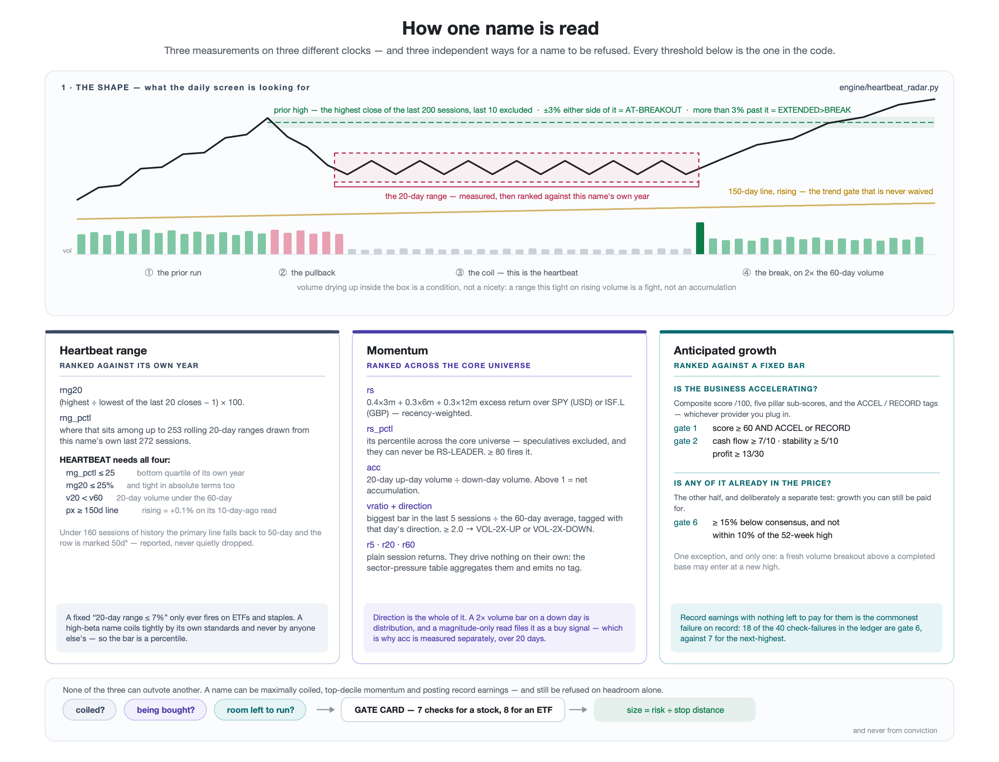
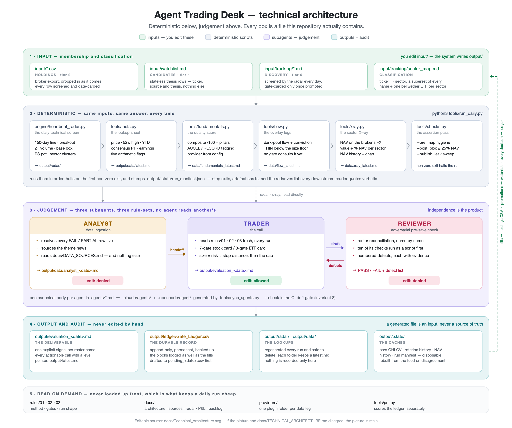

# Agent Trading Desk

### A daily trading evaluation pipeline that refuses to mark its own homework.

[](LICENSE)


Three LLM subagents — one that gathers the data, one that makes the call, one that tries to break it — sit on top of five deterministic Python scripts. **The scripts do the arithmetic. The agents do the judgement. Nothing is saved until an agent that did not write the report signs it off.**

It runs on your own broker export, needs nothing outside the Python standard library, and it keeps **a permanent ledger of every decision — including the ones it refused** — so the rules can be scored rather than trusted. The track record below is generated from that ledger.

> **Experimental. A process framework, not investment advice.**
> A personal system published so the method can be read and picked apart — not a product and nothing in it places an order.
> The data legs are pluggable: every source is a drop-in provider module and the repo ships with free
> defaults, so it runs on nothing but Yahoo or on whatever you already pay for — see
> [Plugging in whatever you already pay for](#plugging-in-whatever-you-already-pay-for).
> Full terms in [`DISCLAIMER.md`](DISCLAIMER.md).

---

## Why this exists

The gate card system gives unbiased, data driven insights on how the market, sectors and trades are performing. Seven checks for a stock, eight for an ETF, and not one of them can see where the idea came from. A YouTube tip, a paid subscription pick and your own screen all clear the same bar or they don't get in — **paid is not a synonym for vetted.** One expensive high-conviction recommendation is still sitting in [`universe.md`](input/tracking/universe.md), tracked but never promoted, because it has never cleared the card.

That check is too multi-dimensional to eyeball: fundamentals, trend, heartbeat, volume character, momentum, event windows, valuation headroom and sector rotation, per name, across the whole roster, every day. **The scripts compute it and the agents judge it** — which is the only reason a gate this wide gets applied consistently instead of waived whenever the story is good enough.

And underneath it, one line that does most of the work: **size = risk ÷ stop distance, never conviction.** A better story cannot buy a bigger position.

---

<!-- SCORECARD:START -->

## Track record

*Counts and percentages only — no position sizes and no cash figures appear anywhere in this section, by construction. Regenerated by [`tools/scorecard.py`](tools/scorecard.py) from the private gate ledger; last built 2026-08-26.*

**179 decisions logged** across **67 names** over **86 days** · 9 published evaluations · 23 lines currently open

### Closed trades

| Ticker | Held | Loss | Gain | Result |
|---|---|---:|:---|---:|
| **PLTR** | 46d |  | 🟩🟩🟩🟩🟩🟩🟩 | +32.8% |
| **ACHR** | 27d |  | 🟩🟩🟩🟩🟩 | +22.4% |
| **NTR** | 21d |  | 🟩🟩 | +11.1% |
| **BLK** | 3d |  | 🟩 | +1.6% |
| **AS** | 8d | 🟥🟥 |  | -9.2% |
| **LIN** | 18d | 🟥🟥 |  | -10.2% |
| **AVGO** | 15d | 🟥🟥 |  | -11.2% |

🟩 **4 up** / 🟥 **3 down** — win rate 57% · average winner +17.0% · average loser -10.2% · median hold 18d

### Gate effectiveness

*Every row is an idea the rules **refused**. The question is not whether each call was right, but whether the rate justifies the rules — a gate that blocks winners costs money silently.*

*81 blocked decisions are logged with a decision price, but none is yet 30 days old — too recent to have been right or wrong. This section fills itself in as they age.*

### Which rules actually bind

*Gate-card checks by how often they were the reason for a refusal — stock and ETF cards counted separately, because checks 1, 2 and 6 are different tests on each. No name attached: this is about the rules, not the roster.*

| Card | Check | Blocked | |
|---|---|---:|---|
| 📈 Stock | **#6** Valuation headroom | 32 | `██████████████` |
| 📈 Stock | **#1** Composite score | 7 | `███░░░░░░░░░░░` |
| 📈 Stock | **#5** Event window | 6 | `███░░░░░░░░░░░` |
| 🧺 ETF | **#3** MA gatekeeper | 6 | `███░░░░░░░░░░░` |
| 🧺 ETF | **#6** Premium / extension | 4 | `██░░░░░░░░░░░░` |
| 📈 Stock | **#4** Volume character | 3 | `█░░░░░░░░░░░░░` |
| 📈 Stock | **#7** Entry discipline | 2 | `█░░░░░░░░░░░░░` |
| 📈 Stock | **#2** Pillar floors | 2 | `█░░░░░░░░░░░░░` |
| 📈 Stock | **#3** MA gatekeeper | 1 | `░░░░░░░░░░░░░░` |
| 🧺 ETF | **#2** Fund structure | 1 | `░░░░░░░░░░░░░░` |

<!-- SCORECARD:END -->

---

## What one run actually produces

Real output from a full `/atd-daily` run, reproduced here because `output/` itself stays private. 105 names on the roster, 105 explicit signals, one sell and one buy trigger — and the buy trigger tells you the price you may **not** pay:

> **KNT.TO** — 🔵 BUY-TRIGGER (STARTER). **GATE: S 6/7** (score 87, Exceptional, ACCEL — highest composite on the whole 105-name roster). Only fail: #6 (headroom 10.9% < 15%, AT-PEAK −8.9%). One fail on 5/6 only → **starter at half risk, the maximum permitted.**
>
> **Do not fill at C$30.22** — that is filling into the exact condition gate 6 blocks. **Written trigger: pullback to ~C$26.50**, where headroom restores to ~26% and AT-PEAK clears. Trading Stop ~C$23.50 · Investing Stop ~C$20.50. Size = half-risk ÷ ~11% stop distance, truncated to the half-cap.

That is the shape of the whole product. Not *"KNT.TO looks strong"* — but a score, the one gate that failed, the price that is forbidden, the price that is permitted, both stops, and the arithmetic that sizes the line. Then the same treatment for the other 104 names, and a sector rotation read underneath the lot.

**Every non-trivial decision — including the ones it blocked — is written to a permanent ledger, automatically, as soon as the report passes review.** That is the part most systems skip. A blocked idea with no recorded price can never be scored, so you can never answer the only question that matters: *are my gates filtering out winners, or saving me from disasters?*

The ledger is also the only thing here that is meant to last. Every other file under `output/` is rebuilt by the next run, so a decision that does not reach the ledger survives exactly as long as its evaluation file does — which is why writing to it is not left to anyone remembering.

---

## The three-agent pipeline



**Why three agents and not one.** A model asked to do arithmetic will *usually* get it right, and "usually" is not auditable. So the technical screen, the lookup legs, the sector weights and the cost-of-deal arithmetic are **scripts** — a script either produces the number or exits non-zero. What is left is genuine judgement: which signals to trust, how a thesis weighs against the macro backdrop, which gate card applies. That is the **Trader's**.

The pre-save check is a **separate agent with a separate context**, because the model that just wrote the report is the worst available judge of whether it is complete — it believes it is. And the data ingestion is a **third** agent for the same reason at the other end of the pipe: whoever decides a data row is good enough should not also be the one who needs it to be good enough.

Three agents, three rule-sets, **and no agent reads another's rulebook.** Exactly one of them is allowed to write the report.

*Editable source: [`docs/3_agent_pipeline.svg`](docs/3_agent_pipeline.svg).*

---

## Running it

Type this into your agent — Claude Code or opencode, the two it is developed and run against:

```
/atd-daily
```

Wrappers for both platforms are generated from one canonical, so the contract cannot drift between them. Other agent harnesses may work — the command is a markdown file and the pipeline underneath is plain Python — but they are **untested**, and anything that sandboxes outbound network will fail Phase A, which fetches price history and fundamentals over HTTP.

That is the whole interface. One instruction runs the deterministic Phase A, then Analyst → Trader → Reviewer, the defect loop and the ledger write, with no human sequencing between steps. The repo ships with a working portfolio, so it has something real to chew on before you commit any data of your own.

To point it at your own book, drop the export in first — the command finds it:

```bash
cp ~/Downloads/my-broker-export.csv input/
```

**Nothing else needs editing** — not a script, not a config file. Column names, Yahoo tickers and sectors are worked out at runtime, and the first run creates the empty ledger and discovery file. With no `input/config/providers.json` present, every fundamentals row returns `NONE` and the gates that depend on it read `GATE1-INFERRED` — honest, and deliberately not a fabricated pass.

**Two things it will not do.** It **halts rather than working around a failure**: if a step exits non-zero it names the step and stops, instead of running the Trader against half-built data. And it **writes nothing to the ledger until the review passes** — the day's decisions are recorded in `output/ledger/Gate_Ledger.csv` only after `eval_reviewer.py` returns 0 defects and the Reviewer returns PASS. The ledger listens to approved output; it does not review it a second time. That matters because the ledger is the system's only durable memory: every other file under `output/` is rebuilt by the next run, so a decision that never reaches it survives only as long as its evaluation file does.

When it finishes, read **`output/evaluation_<date>.md`** — today's dated evaluation.

The run contract is [`agents/orchestrator.md`](agents/orchestrator.md), and the `/atd-daily` wrappers for both platforms are generated from it. The individual steps, for a partial or manual run, are in [`AGENTS.md`](AGENTS.md).

---

## What it does, in one paragraph

A daily script screens your **entire universe** — holdings, watchlist and discovery names — for four technical states: **trend held**, **breakout**, **2× volume**, **tight consolidation**. Those flags cluster by sector to detect **rotation before any individual name looks interesting**. An agent then reads the flags, runs every actionable name through a **gate card** — 7 checks for a stock, 8 for an ETF — sizes from **risk ÷ stop distance** (never from conviction), and writes a dated evaluation with one explicit signal per name.

---

## How a name is read

Everything the system knows about a name begins as one series: daily open/high/low/close/volume, roughly 600 sessions, cached per ticker in `output/.state/bars/` and re-verified against the source on every run. From that single series the radar derives three measurements that answer three different questions — and **each one is ranked against a different thing**, which is the part that does the work.



*Editable source: [`docs/Three_Measurements.svg`](docs/Three_Measurements.svg).*

### 1 · The heartbeat range — is it coiled?

`rng20` is the last 20 closes: `(max ÷ min − 1) × 100`. On its own that number means nothing, because a 6% twenty-day range is a dead stop for a quantum small cap and a violent month for a broad index ETF. So the same measure is recomputed across roughly a year of that name's own history — up to **253 rolling 20-day windows drawn from its last 272 sessions** — and `rng_pctl` is where today sits in that distribution.

`HEARTBEAT` then needs four things at once — and the last two are why it does not fire on a collapse:

| Condition | What it is testing | Why it is there |
|---|---|---|
| `rng_pctl ≤ 25` | bottom quartile of its own year | tight *by its own standards* |
| `rng20 ≤ 25%` | and tight in absolute terms as well | a sanity floor |
| `v20 < v60` | 20-day volume under the 60-day average | nobody is selling into it |
| `px ≥ 150d line`, and the line rising | above the trend filter, which is itself **more than 0.1% higher** than it was 10 sessions ago — inside that band the line reads `Flat` and fails | a downtrend that pauses is not a base |

The breakout reference is computed separately: the highest close of the last 200 sessions **with the most recent 10 excluded**, so a name cannot manufacture its own prior high during the week it is being screened. Within ±3% of it → `AT-BREAKOUT`; more than 3% past it → `EXTENDED>BREAK`. Names with under 160 sessions fall back to a 50-day line and are marked `50d*` — reported, never quietly dropped.

### 2 · Momentum — is anyone actually buying it?

Three measures on three windows, deliberately not collapsed into one score:

| Measure | How it is computed | What it fires |
|---|---|---|
| `rs` → `rs_pctl` | `0.4×3m + 0.3×6m + 0.3×12m` excess return over SPY (USD) or ISF.L (GBP), then **percentile-ranked across the core universe** — every name that scored, speculatives excluded | `RS-LEADER` at ≥ 80 |
| `acc` | 20 sessions of up-day volume ÷ down-day volume | above 1 = net accumulation — a continuous read, no flag |
| `vratio` | biggest bar in the last 5 sessions ÷ the 60-day average, tagged with that day's direction | `VOL-2X-UP` / `VOL-2X-DOWN` at ≥ 2.0 |
| `r5` `r20` `r60` | plain session returns | nothing on their own — see below |

**Speculatives keep a raw `rs` but take no percentile and can never be `RS-LEADER`.** A pre-revenue name's excess return sits at an extreme by construction, and ranking it against a mega-cap would drag the distribution every core name is measured against.

**Relative strength is measured against the market, not against the name's own moving average.** A name can sit comfortably above its own 150-day line and still lose to the index every week; only the second reading tells you whether money is *choosing* it.

**The flags and the continuous measures disagree, on purpose.** `VOL-2X-UP` needs a spike inside 5 sessions; `acc` is a sustained 20-day read. Five names accumulating together for a fortnight therefore light up as one or two names on scattered days — no cluster — which is exactly how an August gold move went unreported while one of its members carried the highest accumulation ratio in the universe and not a single flag. That is why the sector-pressure table aggregates **the measurements** and not the flags.

**But the session returns drive nothing by themselves, and the rotation score is not built from them.** That score is `in − 2×out + 0.5×(early − late) + 0.3×gauge_momentum` — flag counts, plus the 20-day return of the sector's **bellwether ETF**, never its members'. `r5`/`r20`/`r60` are aggregated only into the sector-pressure table, which is deliberately measurement-only: no tag, no state, no flag. Acting on it is an open backlog item, and it is kept there on purpose.

### 3 · Anticipated growth — and whether any of it is already in the price

This is the question the price series cannot answer, and the one that gets conflated most often, so the rules split it in two and require both halves.

**Is the business accelerating?** A composite score `/100`, five pillar sub-scores and the `ACCEL` / `RECORD` tags, from whichever fundamentals provider is configured. Gate 1 wants **score ≥ 60 *and* ACCEL or RECORD** — not one or the other. Gate 2 puts floors under the pillars — cash flow ≥ 7/10, stability ≥ 5/10, profit ≥ 13/30 — so a respectable composite cannot be carried entirely by one strong leg.

**Is any of it already paid for?** Gate 6 wants **≥ 15% below consensus, and not within 10% of the 52-week high.** Growth you cannot be paid for is not an opportunity. There is exactly one exception to the second half — a fresh volume breakout above a completed base may enter at a new high — and it is written into the card rather than granted case by case.

Keeping those two apart is not pedantry. Gate 6 is the check that fails most often by a wide margin — **18 of the 40 check-failures recorded in the ledger, against 7 for the next-highest.** Not all 40 are refusals: a name failing only #6 with the first five clean is still bought, at starter size. The KNT.TO excerpt further up is exactly that case — the highest composite on a 105-name roster, tagged ACCEL, clean on the other six gates, and cut to a starter purely on headroom.

### Where this departs from the pattern-trading version of the same idea

Three places, each because the textbook form did not survive contact with a real roster:

- **A fixed "20-day range ≤ 7%"** only ever fires on ETFs and defensive staples. A high-beta name coils tightly by its own standards and never by anyone else's — so the bar became a percentile.
- **A volume threshold with no direction** files distribution as a buy signal. A 2× bar on a down day is institutions leaving. Direction is carried on the flag, and a separate 20-day accumulation ratio measures the thing a single bar cannot.
- **Relative strength against a name's own moving average** says nothing about whether the market prefers it. It is measured against a currency-matched benchmark and ranked across the universe instead.

And none of the three measurements can outvote another. A weighted composite would let a spectacular fundamental read pay for a broken chart, which is the failure the gate card exists to prevent. What reaches the Trader is a row of measurements and a set of flags; what reaches the ledger is **which check refused**, so the bars themselves can be scored later.

---

## The core mechanics

### The gate card

Seven checks. **All must pass for full size.** One fail on the event window or valuation headroom, with the first four clean → starter, half risk. **Two fails → watchlist only, regardless of story.**

| # | Check | Bar |
|---|---|---|
| 1 | Composite score | ≥ 60 **and** tagged ACCEL or RECORD |
| 2 | Pillar floors | Cash Flow ≥ 7/10, Stability ≥ 5/10, Profit ≥ 13/30 |
| 3 | MA gatekeeper | Price above a **rising** trend MA |
| 4 | Volume character | Accumulation; no red distribution spikes in 10 sessions |
| 5 | Event window | No earnings within 14D; no binary event within 10 trading days |
| 6 | Valuation headroom | ≥ 15% below consensus; not within 10% of the 52-week high |
| 7 | Entry discipline | Fill within 2–3% of the **written** trigger — otherwise log it and wait for the retest |

### Two tiers

- **Quality** — up to 5% of sleeve NAV at cost, two stops, every gate on its vehicle's card.
- **Speculative** — 0.75% of sleeve NAV, fixed, **no stop** (the stake *is* the stop), score floor lowered to 15, max 5 concurrent.

The second tier exists because the gate card structurally blocks every high-upside small cap, and the previous workaround — full size plus a tight stop in a 100%-volatility name — was the worst of both worlds.

### Sizing

**Risk first, size second.** `size = risk ÷ stop distance`, then truncate to the cap. Never size from conviction.

---

## Three principles worth stealing even if you use nothing else

1. **The cap is a sizing constraint, not a signal.** Rate every name on its merits as if no position were held, then state the cap consequence separately: `🟢 BUY (capped)`. Downgrading a BUY to HOLD because the position is full hides your buy queue at exactly the moment it matters.
2. **Theme membership is a lens, never a gate.** Any sector the radar tags ROTATION-IN is an active theme by definition. Filtering candidates by an old theme list encodes the *previous* rotation.
3. **Log the blocks, not just the fills.** A blocked idea with no recorded price can never be scored — and an unmeasured rule eventually gets relaxed on vibes.

---

## What this repo publishes, and what it doesn't

The track record above is **real** — real tickers, real decisions, a real ledger behind it. What is deliberately absent is **every number that implies a size**: no quantities, no cash figures, no position values, no sleeve NAV. The working papers stay private; the evidence they produce does not.

That split is not squeamishness, it is the only version of this that is safe to publish. A track record proves a method works; a position size tells a stranger how much money is behind it, which is a personal-safety question rather than a design preference. Percentages settle the first question without touching the second — a 62% win rate reads identically on a £10k sleeve and a £10m one.

So the boundary runs like this:

| Published | Private |
|---|---|
| The full ruleset, engine and agent contracts | Broker exports, holdings, sleeve NAV |
| The track record, as counts and percentages | Daily evaluations and the gate ledger itself |
| Closed trades: ticker, how it was found, % result | Open positions, entry prices, stop levels |
| Which gate checks actually bind | Intermediates — radar state, facts, scored data |

[`tools/scorecard.py`](tools/scorecard.py) is what enforces it. It reads the private ledger, emits only counts and ratios, and **refuses to write** if a currency figure or a quantity survived into its output — because the failure mode is never today's code, it is one helpful column added six months from now that nobody re-reads before pushing.

Publishing is still a decision you make once: git history is permanent. But what reaches it is now generated by a script with a guard, rather than assembled by hand under time pressure.

---

## Under the hood



Four layers, and the rule that keeps them apart: **you edit `input/`, the system writes `output/`, and a generated file is an input, never a source of truth.** The full text — file roles, the ticker lifecycle, the rotation design, the nine invariants — is in [`docs/TECHNICAL_ARCHITECTURE.md`](docs/TECHNICAL_ARCHITECTURE.md). *Editable source: [`docs/Technical_Architecture.svg`](docs/Technical_Architecture.svg).*

### What you need to supply

The rules are source-agnostic. Three legs — see [`docs/DATA_SOURCES.md`](docs/DATA_SOURCES.md) for what substitutes work.

| Leg | Supplies |
|---|---|
| **Fundamentals scorer** | Composite quality score, pillar sub-scores, earnings-acceleration tags |
| **Chart / darkpool platform** | MA direction, volume accumulation vs distribution, base structure, darkpool prints |
| **Web search** | Price, 52-week high, consensus PT, earnings date, rating changes |

**None of these are needed for the radar**, which handles price history itself and wants nothing beyond an internet connection. They are what the Trader run needs to work the gate card.

### Plugging in whatever you already pay for

Each leg reads a **provider** — a plugin module discovered from `providers/`, named in `input/config/providers.json`. Nothing in core knows any vendor's name.

```
providers/
  fundamentals/{none,derived,example}.py     ship in the repo
  darkpool/{none,example}.py
  conviction/{none,example}.py
  private/<leg>/*.py                          gitignored — your paid sources
```

To add a source: copy `providers/<leg>/example.py`, fill in the declaration, implement one function, point the config at it. No registry to edit, no core changes. `python3 tools/fundamentals.py --list-providers` shows what is installed; `python3 tools/checks.py --pre` validates every provider on disk against the contract.

Paid providers stay private structurally, not textually. `providers/private/` and `input/capture/` are gitignored, and the publish step works from an **allow-list** — nothing reaches the public tree unless a pattern names it, so a source added tomorrow is private by default rather than public until somebody remembers to exclude it. A directory that was never copied cannot be leaked by an oversight in a docstring.

That is the mechanism. On top of it the build also **fails outright if any published file so much as names a private provider**, which is the backstop for prose — a comment, a usage example, a stale incident note. Structure first, text second, and the text check exists because the structural one says nothing about what a docstring mentions.

The `none` default ships publish-safe: every row returns `NONE`, and the affected gates read `GATE1-INFERRED` rather than a fabricated pass.

---

## Where to read next

**If you are a person deciding whether this is for you**, in this order:

| Document | Why |
|---|---|
| `output/evaluation_<date>.md` | A real evaluation. Start here — everything else explains how this file gets made |
| [`docs/RADAR.md`](docs/RADAR.md) | The Heartbeat Radar in full: every flag, what it means, why it was chosen — the long form of [How a name is read](#how-a-name-is-read) |
| [`rules/02_SLEEVE_RULES.md`](rules/02_SLEEVE_RULES.md) | The gate cards and sizing in full |
| [`docs/PNL.md`](docs/PNL.md) | How the ledger scores whether the gates are earning their keep |

**If you are an agent, or a human about to change something:**

| Document | Why |
|---|---|
| [`docs/TECHNICAL_ARCHITECTURE.md`](docs/TECHNICAL_ARCHITECTURE.md) | The change contract: file roles, ticker lifecycle, two-sleeve model, rotation design, **the nine invariants**. Read before touching any file it names — this is the AI's entry point, see [`AGENTS.md`](AGENTS.md) |
| [`docs/DATA_SOURCES.md`](docs/DATA_SOURCES.md) | The source/provider contract, and why `INFERRED` is not a fabricated pass |
| [`rules/01_METHOD.md`](rules/01_METHOD.md) · [`rules/03_DAILY_RUN.md`](rules/03_DAILY_RUN.md) | Method and run shape. Read on demand, not on load |
| [`docs/BACKLOG.md`](docs/BACKLOG.md) | The single register of open work (⏳ open · ✅ done · ⬜ declined) |
| [`docs/DARKPOOL_FIRST_PROPOSAL.md`](docs/DARKPOOL_FIRST_PROPOSAL.md) | Live proposal — read its banner first. Required reading before changing anything in the rotation path |

---

## Repository layout

**One rule: you edit `input/`, the system writes `output/`. Nothing else moves.**

<details>
<summary><b>The full tree</b></summary>

```
input/                    ← everything you own and edit
  *.csv                   broker exports, dropped in as-is   ← the only required input
  watchlist.md            your candidate registry             (optional, Tier 1)
  tracking/               radar-only coverage                 (optional, Tier 0)
    universe.md           sweep / YouTube / research / manual
    sector_map.md         ticker → sector + bellwether ETFs   (reference, overrides guesses)
  config/
    providers.json.example  publish-safe template: every leg on `none`
    providers.json          your live provider choices        (gitignored)

output/                   ← everything generated; never edit by hand
  evaluation_<date>.md    dated evaluation, accumulates each run
  radar/                  Heartbeat_Radar_<date>.md
  data/                   analyst_ · facts_ · fundamentals_ · darkpool_ · xray_<date>
  ledger/                 Gate_Ledger.csv  ← append-only, permanent, back it up
  .state/                 radar + rotation state (disposable)

docs/                     ← operational user-guides
  TECHNICAL_ARCHITECTURE.md   The change contract + invariants (the AI's entry point)
  Technical_Architecture.svg/.png   Diagram of the same — kept for human readers
  3_agent_pipeline.svg/.png   The three-agent pipeline diagram
  Three_Measurements.svg/.png  How one name is read — range, momentum, growth
  DATA_SOURCES.md         Source/provider contract
  RADAR.md                Radar user-guide
  PNL.md                  P&L ledger and gate scoring
  BACKLOG.md              The single register of open work
  BACKFILL_2026-08-14.md  Provenance for the state files
  DERIVED_CALIBRATION_…   Provider calibration journal
  DARKPOOL_FIRST_PROPOSAL.md  Live proposal: darkpool leg replaces the inferred rotation read
  SMART_MONEY_BOARD.md    Its design — provider contract, significance floor, twin table
  DARKPOOL_PARALLEL_RUN_<d>.md  Parallel-run log, one per run, until Phase 1 ships
  ROTATION_EVIDENCE_…     Provenance for the 26–31% figure behind the proposal
  archive/                Superseded design journals, kept for provenance

rules/                    ← the rulebooks (governance, read on demand)
  01_METHOD.md            Three signals, entry filter stack, 150-day rule
  02_SLEEVE_RULES.md      Gate card, two tiers, sizing, stops, caps
  03_DAILY_RUN.md         The execution shape of the pipeline

agents/                   canonical agent + orchestration contracts
  analyst.md              data ingestion (input contract only, no rulebooks)
  trader.md               the call (reads rulebooks fresh)
  manager.md              pre-save check (no rulebooks, self-contained checklist)
  orchestrator.md         the run sequence — body of the /atd-daily command
  publisher.md            the publish sequence — body of the /atd-publish command
  housekeeper.md          the cleanup sequence — body of the /atd-housekeeping command
  → .claude/agents/       platform wrappers (generated by tools/sync_agents.py)
  → .opencode/agent/      (opencode)
  → .claude/commands/     /atd-daily + /atd-publish + /atd-housekeeping wrappers · → .opencode/command/
  → invariant 8: --check  drift is caught by CI

engine/                   daily radar
tools/                    facts · fundamentals · xray · pnl · checks · append_gate_ledger · rerun · housekeeping
providers/                pluggable data sources, one folder per leg
templates/                starting points for watchlists and the ledger
```

</details>

Both directions are overridable — `--input-dir` / `--output-dir`, or the `TP_INPUT` / `TP_OUTPUT` environment variables — so one checkout can serve several portfolios that never see each other's data.

---

## What this is not

- **Not backtested.** These are process rules derived from post-mortems, not a validated statistical edge. The ledger exists precisely because nothing here has been proven.
- **Not automated trading.** Nothing places orders. Every output is a recommendation for a human to act on or ignore.
- **Not tax- or jurisdiction-aware.** Currency handling assumes a sterling base with USD positions; adapt it.
- **Not a stock picker.** It tells you *whether and how much*, never *what to believe*.

---

## Contributing

The most useful contributions are **failure post-mortems**: a rule that let something through, what it cost, and the specific check that would have caught it. Every rule in `rules/02_SLEEVE_RULES.md` started that way. Rules without a named failure behind them tend to get relaxed the first time they're inconvenient.

**One hard rule for any PR touching the report format.** `agents/manager.md` restates the format rules rather than reading them — so the checklist can drift out of date without any error appearing. **If you change a rule the reviewer encodes, change the checklist in the same commit** and run `python3 tools/sync_agents.py` so both platform wrappers stay in sync. A reviewer quietly checking last month's format is worse than no reviewer at all, because its PASS still reads as assurance. This is invariant 8 in [`docs/TECHNICAL_ARCHITECTURE.md`](docs/TECHNICAL_ARCHITECTURE.md).

## Licence

MIT — see [`LICENSE`](LICENSE).
